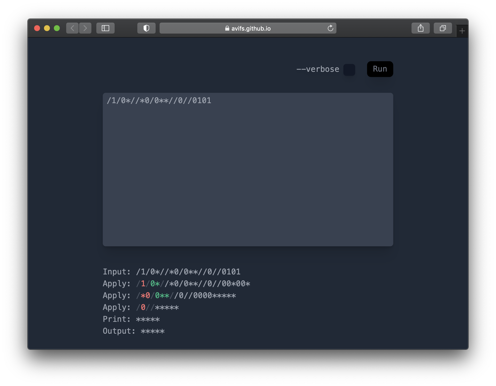
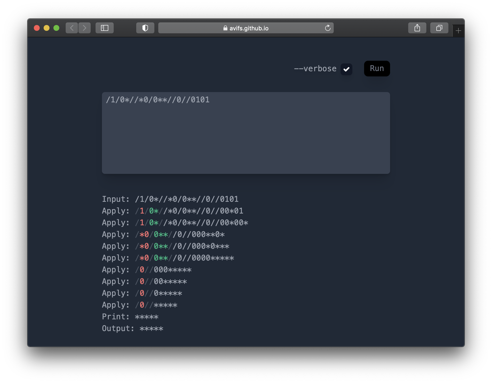

A nice interface for playing around with the [///](https://esolangs.org/wiki////) esolang (pronounced slashes). One of the great turing tarpits, it's nontrivial to work with. Hopefully this'll make it easier!

You can play around with it on my interpreter here, or read more about it on the Esolangs Wiki page linked above. To whet your appetite, here's a simple hello world.

</img>

And here's a [binary to unary converter](https://esolangs.org/wiki////#Binary_to_unary_conversion) without `--verbose` enabled:

</img>

And with `--verbose` enabled:

</img>

Does the verbose output help you understand how this program works? No? Me neither! But I promise it's often helpful.
